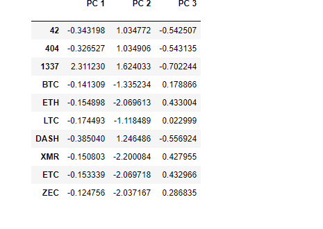
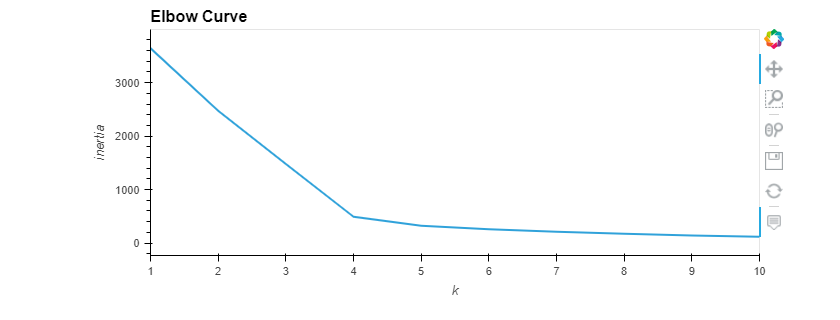
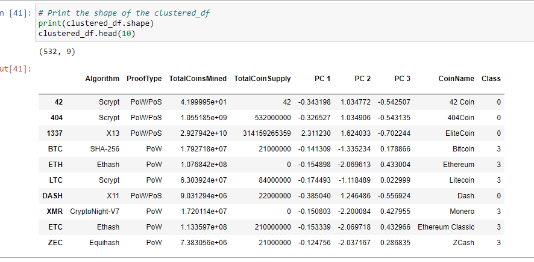
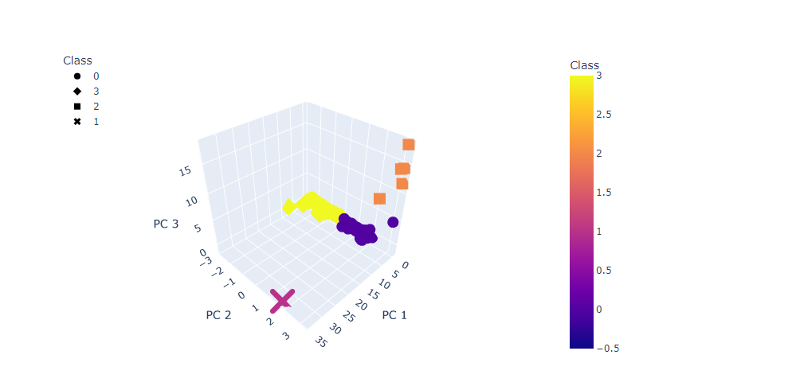
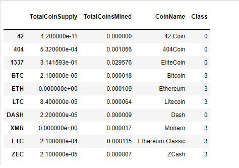
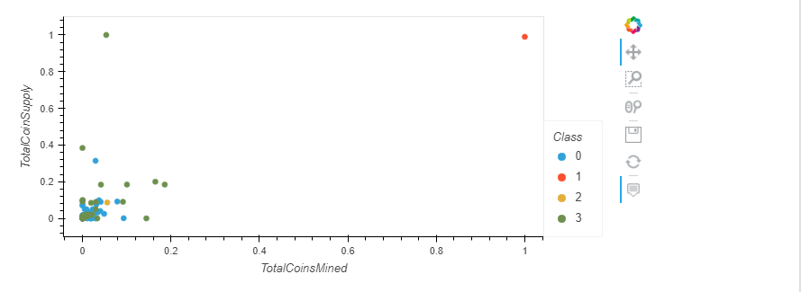

# Cryptocurrencies
## Overview
 ### Purpose
 The client requested for a report that includes what cryptocurrencies are on trading market and how they could be grouped to create a classification system for their new investment plan.To create this plan we decided to use clustering algorithm to group the cryptocurrencies and use data visualizations to share the findings with the board.
 
 This project consists of four technical analysis:
 
                        1)  Preprocessing the Data for PCA(Principal Component Analysis)
                        2)  Reducing Data Dimensions Using PCA
                        3)  Clustering Cryptocurrencies Using K-means
                        4)  Visualizing Cryptocurrencies Results
                        
 ## Results
 
 ### The dataframe created from imported data,1252 rows of data:
 
   #### 

 
 
### Below image shows the result of tradable cryptocurrenciesafter cleaning the data,532 rows of data.
 
 
   #### 
   
### Result of PCA algorithm that reduce the dimensions to three principal components.

  #### 
  
  
###  The K-means algorithm is used to  cluster the cryptocurrencies using PCA(Principal Component Analysis)data.
###  An elbow curve used is created using hvplot to find the best value for K;K=4.
 

  #### 

###  Applying the Principal Component Analysis:

 #### 
 
###  Created a 3D-Scatter with the PCA data and the clusters.

 ####  
 
 
###  Number of Tradable Cryptocurrencies,DataFrame to plot results:

 #### 
 
###  Visualizing Cryptocurrencies Results
###  Create an hvplot scatter plot with x="TotalCoinsMined", y="TotalCoinSupply", and by="Class".

#### 
 
 

  
  

   
   

 
 
 
 
 
 
